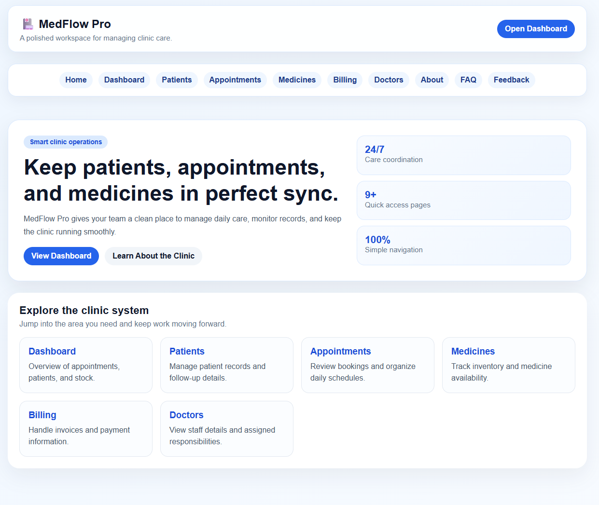

# 🏥 Clinic Management System

## 📌 Overview

The **Clinic Management System** is a web-based application developed to automate and organize clinic operations. It provides an efficient platform for managing patients, doctors, appointments, medicines, billing, and medical records through a centralized system.

The system reduces manual workload, improves data accuracy, enhances information accessibility, and provides healthcare providers with a convenient way to manage daily clinic activities.

---

## ✨ Features

### 📊 Dashboard
- Provides an overview of clinic activities
- Displays important statistics and information

### 👤 Patient Management
- Add new patients
- View patient information
- Search and manage patient records

### 📅 Appointment Management
- Book appointments
- View scheduled appointments
- Cancel appointments when required

### 💊 Medicine Management
- Track medicine stock
- Manage available medicines

### 💰 Billing Management
- Generate and manage bills
- Maintain billing information

### 👨‍⚕️ Doctor Management
- Manage doctor information
- Store doctor-related details

---

## 📂 Project Structure

```text
Clinic-Management-System/
├── README.md
├── index.html
├── css/
│   └── styles.css
├── js/
│   ├── app.js
│   └── patient.js
├── pages/
│   ├── about.html
│   ├── appointments.html
│   ├── billing.html
│   ├── dashboard.html
│   ├── doctors.html
│   ├── faq.html
│   ├── feedback.html
│   ├── healthtip.html
│   ├── medicines.html
│   └── patients.html
└── assets/
    └── man-profile_1083548-15963.avif
```

---

## 🖥️ Included Pages

| Page | Description |
|---|---|
| Dashboard | Overview of clinic statistics and activities |
| Patients | Add, view, and search patient records |
| Appointments | Book, view, and cancel appointments |
| Medicines | Monitor medicine stock |
| Billing | Generate simple bills |
| Doctors | Manage doctor information |

---

## 🛠️ Technologies Used

- HTML5
- CSS3
- JavaScript
- Git & GitHub
- Visual Studio Code

---

## 📸 Screenshots


---

## 👥 Contributors

- **H.S.B. Edirisooriya** (GWU-HICT-2022-07)
- **K.M.T. Hansamal** (GWU-HICT-2022-46)
- **W.M.B.D. Wihethunga** (GWU-HICT-2022-67)
- **A.H.M.A.K. Aberathna** (GWU-HICT-2022-56)
- **W.H.H.P. Hettiarachchi** (GWU-HICT-2022-04)

--- 

## 🚀 Future Improvements

- Database integration for permanent data storage
- User authentication system
- Online appointment booking
- Automated notifications
- Advanced medical record management
- Mobile application support

---

## 📄 License

This project was developed as an academic project for educational purposes.

